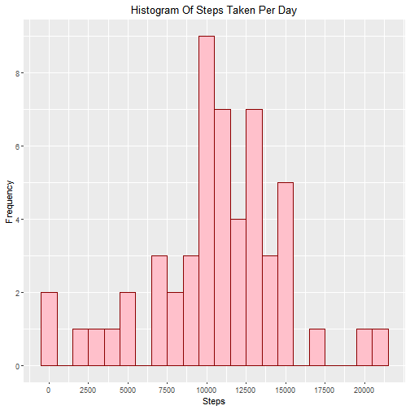
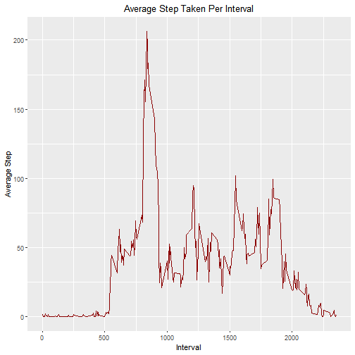
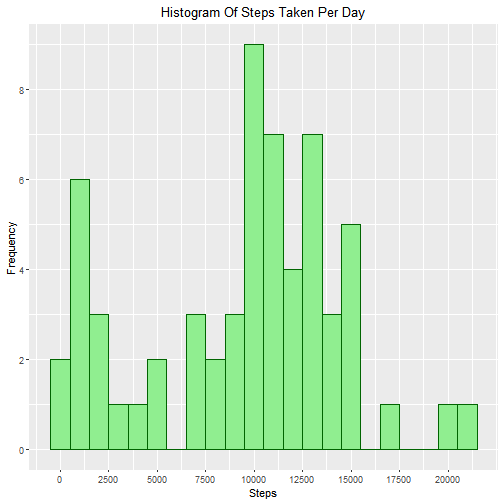
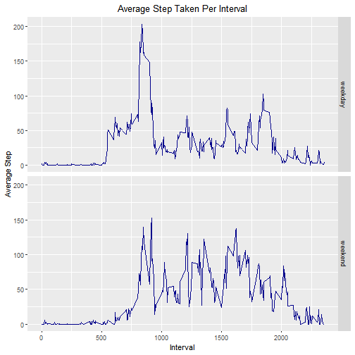

# Reproducible Research by JHU: Peer Assessment 1

#### Linh Dang - 5 Jan 2020  

This is my submission for the first project in "Reproducible Research" by JHU on Coursera. The data used is `activity.csv`, which is unzipped from this zip file: [activity.zip](https://github.com/linhdang0191/RepData_PeerAssessment1/blob/master/activity.zip)

For more information about the data, read [README](https://github.com/linhdang0191/RepData_PeerAssessment1/blob/master/README.md).

## Loading and Preprocessing Data
Assume that we already have `activity.csv` in the working directory, use `read.csv()` to read it. 


```r
# Read the data
data <- read.csv('activity.csv')
```

We obtaine a dataframe containing 17,568 observations with 3 variables: `steps`,`date`, and `interval`.


```r
str(data)
```

```
## 'data.frame':	17568 obs. of  3 variables:
##  $ steps   : int  NA NA NA NA NA NA NA NA NA NA ...
##  $ date    : Factor w/ 61 levels "2012-10-01","2012-10-02",..: 1 1 1 1 1 1 1 1 1 1 ...
##  $ interval: int  0 5 10 15 20 25 30 35 40 45 ...
```

Import necessary packages:

```r
library(dplyr) # for easier data manipulation
library(ggplot2) # for plotting
```

## What is mean total number of steps taken per day?

1. Calculate total number of steps taken per day

2. Make a histogram of total number of steps taken per day

3. Calculate the mean and median of total number of steps taken per day

First, let's create a new dataset with sum of steps taken per day.


```r
stepPerDay <- data %>% group_by(date) %>% summarise(steps = sum(steps))
```


We obtain a dataframe with 61 observations and 2 variables (with some NA rows).


```r
stepPerDay
```

```
## # A tibble: 61 x 2
##    date       steps
##    <fct>      <int>
##  1 2012-10-01    NA
##  2 2012-10-02   126
##  3 2012-10-03 11352
##  4 2012-10-04 12116
##  5 2012-10-05 13294
##  6 2012-10-06 15420
##  7 2012-10-07 11015
##  8 2012-10-08    NA
##  9 2012-10-09 12811
## 10 2012-10-10  9900
## # … with 51 more rows
```


Then make a histogram.


```r
g <- ggplot(stepPerDay, aes(steps)) + geom_histogram(col = 'darkred', fill = 'pink', binwidth = 1000) +  labs(title = "Histogram Of Steps Taken Per Day", x = "Steps", y = "Frequency") + theme(plot.title = element_text(hjust = 0.5)) + scale_x_continuous(breaks = seq(0,20000,2500)) + scale_y_continuous(breaks = seq(0,20,2))
# Show the plot
g
```




Mean and median of the total number of steps taken per day (ignore the NAs).


```r
# Mean 
mean(stepPerDay$steps, na.rm = TRUE)
```

```
## [1] 10766.19
```

```r
# Median
median(stepPerDay$steps, na.rm = TRUE)
```

```
## [1] 10765
```

As we can observe, the mean and median are 2 close values. 

## What is the average daily activity pattern?

1. Make a time-serie plot of 5-minute interval (x-axis) and the averaged steps taken across all days (y-axis)

2. Find the interval containing the maximum number of steps

Let's create a new dataframe aggregating number of steps taken in each interval and calculate their average values.


```r
stepPerInterval <- data %>% group_by(interval) %>% summarise(averageStep = mean(steps,na.rm = TRUE))
```


We obtain a new dataframe with 288 observations and 2 variables.


```r
str(stepPerInterval)
```

```
## Classes 'tbl_df', 'tbl' and 'data.frame':	288 obs. of  2 variables:
##  $ interval   : int  0 5 10 15 20 25 30 35 40 45 ...
##  $ averageStep: num  1.717 0.3396 0.1321 0.1509 0.0755 ...
```


Make a time-serie plot of 5-minute interval and the averaged steps taken across all days.


```r
g1 <- ggplot(stepPerInterval, aes(interval,averageStep)) + geom_line(col = "darkred") + labs(title = "Average Step Taken Per Interval", x = "Interval", y = "Average Step") + theme(plot.title = element_text(hjust = 0.5)) + scale_x_continuous(breaks = seq(0,4000,500))
# Show the plot 
g1
```



Find the interval containing maximum number of steps.


```r
stepPerInterval[which.max(stepPerInterval$averageStep),]
```

```
## # A tibble: 1 x 2
##   interval averageStep
##      <int>       <dbl>
## 1      835        206.
```

The interval `835` contains the maximum number of steps (`206.1698113`).

## Imputing missing values

1. Calculate and report the number of missing values in the dataset

2. Devise a strategy to fill in missing values

3. Create a new dataset with missing values filled in 

4. Make a histogram with the total number of steps taken per day, calculate mean and median with the new dataset


Observing the original dataset, we could conclude that the only column with NAs is `steps`. Therefore, we could apply `is.na()` on `steps` only. 

Since `is.na()` will label rows with NA as `TRUE` and the other with `FALSE`, use `sum()` to calculate the number of NAs.


```r
sum(is.na(data$steps))
```

```
## [1] 2304
```


It is optional, but I would calculate the percentage of NAs in the original dataset.


```r
sum(is.na(data$steps))/NROW(data$steps)
```

```
## [1] 0.1311475
```

About 13% values of `steps` are NAs. 

To impute missing values, there are multiple strategies to choose from. One common option to deal with numerical missing values is filling them with suitable means/medians. 

However, I would use a method called MICE (Multivariate Imputation by Chained Equation), which enables us to fill in NAs with more "reasonable" values. 

For more information, please reference to this [paper](https://www.jstatsoft.org/article/view/v045i03) and [R Documentation for mice](https://www.rdocumentation.org/packages/mice/versions/3.7.0/topics/mice).

To use this method, let's import `mice`


```r
library(mice)
```

Fill in NAs and create a new dataset. The process will take a while. 


```r
completeData <- complete(mice(data),1)
```

```
## 
##  iter imp variable
##   1   1  steps
##   1   2  steps
##   1   3  steps
##   1   4  steps
##   1   5  steps
##   2   1  steps
##   2   2  steps
##   2   3  steps
##   2   4  steps
##   2   5  steps
##   3   1  steps
##   3   2  steps
##   3   3  steps
##   3   4  steps
##   3   5  steps
##   4   1  steps
##   4   2  steps
##   4   3  steps
##   4   4  steps
##   4   5  steps
##   5   1  steps
##   5   2  steps
##   5   3  steps
##   5   4  steps
##   5   5  steps
```

We receive a new dataset which is equal to the original dataset with missing values filled in. 


```r
str(completeData)
```

```
## 'data.frame':	17568 obs. of  3 variables:
##  $ steps   : int  0 0 0 0 0 0 0 0 0 0 ...
##  $ date    : Factor w/ 61 levels "2012-10-01","2012-10-02",..: 1 1 1 1 1 1 1 1 1 1 ...
##  $ interval: int  0 5 10 15 20 25 30 35 40 45 ...
```


Now, we make a histogram of total number of steps taken per day with the new dataset.  

Create a dataframe with total number of steps taken per day.


```r
c_stepPerDay <- completeData %>% group_by(date) %>% summarise(steps = sum(steps))
```

Make a new histogram.


```r
g2 <- ggplot(c_stepPerDay, aes(steps)) + geom_histogram(col = 'darkgreen', fill = 'lightgreen', binwidth = 1000) +  labs(title = "Histogram Of Steps Taken Per Day", x = "Steps", y = "Frequency") + theme(plot.title = element_text(hjust = 0.5)) + scale_x_continuous(breaks = seq(0,20000,2500)) + scale_y_continuous(breaks = seq(0,20,2))
# Show the plot
g2
```



By imputing missing values, we could see some changes are introduced to the histogram. To be more specific, we could see how the steps 0 - 2500 and 7500 - 10000 - 12500 has changed, which means the imputation has altered the frequency of some ranges of step in the dataset. 


Calculate the mean and median of total number of steps taken per day.


```r
# Mean
mean(c_stepPerDay$steps)
```

```
## [1] 9358.475
```

```r
# Median 
median(c_stepPerDay$steps)
```

```
## [1] 10395
```


The difference between mean and median in the new dataset is bigger than in the original dataset.

## Are there differences in activity patterns between weekdays and weekends?

1. Create a new factor variable with 2 levels: `weekday` and `weekend`.

2. Make a panel time-serie plot containing the 5-minute interval (x-axis) and the average number of steps taken, averaged across all weekday days or weekend days (y-axis)


My approach for the factor variable is: create a vector to indicate weekdays; use that vector to create a factor based on logical value returend from the condition (if values returned by `weekdays()` is in the `weekdays` vector, then it is `weekday`, else, it is `weekend`)


```r
completeData$date <- as.Date(completeData$date)

# create a vector to indicate weekdays 
weekdays <- c('Monday', "Tuesday", "Wednesday", "Thursday", "Friday")

# create a column indicating day type 
completeData$dayType <- factor(weekdays(completeData$date) %in% weekdays, levels = c(TRUE,FALSE), labels = c("weekday", "weekend"))

# I create one more new column to indicate the day name
completeData$day <- factor(weekdays(completeData$date))
```

We now check if the factor variables have been created.


```r
str(completeData)
```

```
## 'data.frame':	17568 obs. of  5 variables:
##  $ steps   : int  0 0 0 0 0 0 0 0 0 0 ...
##  $ date    : Date, format: "2012-10-01" "2012-10-01" "2012-10-01" ...
##  $ interval: int  0 5 10 15 20 25 30 35 40 45 ...
##  $ dayType : Factor w/ 2 levels "weekday","weekend": 1 1 1 1 1 1 1 1 1 1 ...
##  $ day     : Factor w/ 7 levels "Friday","Monday",..: 2 2 2 2 2 2 2 2 2 2 ...
```

To make the panel containing time-serie plots, first we create a new dataframe of 5-minute interval with averaged steps taken across weekdays and weekends. 


```r
day_stepPerInterval <- completeData %>% group_by(interval,dayType) %>% summarise(averageStep = mean(steps))
```

The result is a datafram containg 576 observations and 3 variables. 


```r
str(day_stepPerInterval)
```

```
## Classes 'grouped_df', 'tbl_df', 'tbl' and 'data.frame':	576 obs. of  3 variables:
##  $ interval   : int  0 0 5 5 10 10 15 15 20 20 ...
##  $ dayType    : Factor w/ 2 levels "weekday","weekend": 1 2 1 2 1 2 1 2 1 2 ...
##  $ averageStep: num  2.022 0 0.4 0 0.156 ...
##  - attr(*, "groups")=Classes 'tbl_df', 'tbl' and 'data.frame':	288 obs. of  2 variables:
##   ..$ interval: int  0 5 10 15 20 25 30 35 40 45 ...
##   ..$ .rows   :List of 288
##   .. ..$ : int  1 2
##   .. ..$ : int  3 4
##   .. ..$ : int  5 6
##   .. ..$ : int  7 8
##   .. ..$ : int  9 10
##   .. ..$ : int  11 12
##   .. ..$ : int  13 14
##   .. ..$ : int  15 16
##   .. ..$ : int  17 18
##   .. ..$ : int  19 20
##   .. ..$ : int  21 22
##   .. ..$ : int  23 24
##   .. ..$ : int  25 26
##   .. ..$ : int  27 28
##   .. ..$ : int  29 30
##   .. ..$ : int  31 32
##   .. ..$ : int  33 34
##   .. ..$ : int  35 36
##   .. ..$ : int  37 38
##   .. ..$ : int  39 40
##   .. ..$ : int  41 42
##   .. ..$ : int  43 44
##   .. ..$ : int  45 46
##   .. ..$ : int  47 48
##   .. ..$ : int  49 50
##   .. ..$ : int  51 52
##   .. ..$ : int  53 54
##   .. ..$ : int  55 56
##   .. ..$ : int  57 58
##   .. ..$ : int  59 60
##   .. ..$ : int  61 62
##   .. ..$ : int  63 64
##   .. ..$ : int  65 66
##   .. ..$ : int  67 68
##   .. ..$ : int  69 70
##   .. ..$ : int  71 72
##   .. ..$ : int  73 74
##   .. ..$ : int  75 76
##   .. ..$ : int  77 78
##   .. ..$ : int  79 80
##   .. ..$ : int  81 82
##   .. ..$ : int  83 84
##   .. ..$ : int  85 86
##   .. ..$ : int  87 88
##   .. ..$ : int  89 90
##   .. ..$ : int  91 92
##   .. ..$ : int  93 94
##   .. ..$ : int  95 96
##   .. ..$ : int  97 98
##   .. ..$ : int  99 100
##   .. ..$ : int  101 102
##   .. ..$ : int  103 104
##   .. ..$ : int  105 106
##   .. ..$ : int  107 108
##   .. ..$ : int  109 110
##   .. ..$ : int  111 112
##   .. ..$ : int  113 114
##   .. ..$ : int  115 116
##   .. ..$ : int  117 118
##   .. ..$ : int  119 120
##   .. ..$ : int  121 122
##   .. ..$ : int  123 124
##   .. ..$ : int  125 126
##   .. ..$ : int  127 128
##   .. ..$ : int  129 130
##   .. ..$ : int  131 132
##   .. ..$ : int  133 134
##   .. ..$ : int  135 136
##   .. ..$ : int  137 138
##   .. ..$ : int  139 140
##   .. ..$ : int  141 142
##   .. ..$ : int  143 144
##   .. ..$ : int  145 146
##   .. ..$ : int  147 148
##   .. ..$ : int  149 150
##   .. ..$ : int  151 152
##   .. ..$ : int  153 154
##   .. ..$ : int  155 156
##   .. ..$ : int  157 158
##   .. ..$ : int  159 160
##   .. ..$ : int  161 162
##   .. ..$ : int  163 164
##   .. ..$ : int  165 166
##   .. ..$ : int  167 168
##   .. ..$ : int  169 170
##   .. ..$ : int  171 172
##   .. ..$ : int  173 174
##   .. ..$ : int  175 176
##   .. ..$ : int  177 178
##   .. ..$ : int  179 180
##   .. ..$ : int  181 182
##   .. ..$ : int  183 184
##   .. ..$ : int  185 186
##   .. ..$ : int  187 188
##   .. ..$ : int  189 190
##   .. ..$ : int  191 192
##   .. ..$ : int  193 194
##   .. ..$ : int  195 196
##   .. ..$ : int  197 198
##   .. .. [list output truncated]
##   ..- attr(*, ".drop")= logi TRUE
```

Make the plot.


```r
g3 <- ggplot(day_stepPerInterval,aes(interval,averageStep)) + geom_line(col = "darkblue") + facet_grid(dayType~.) + labs(title = "Average Step Taken Per Interval", x = "Interval", y = "Average Step") + theme(plot.title = element_text(hjust = 0.5))
# Show the plot
g3
```



Okay, done!

